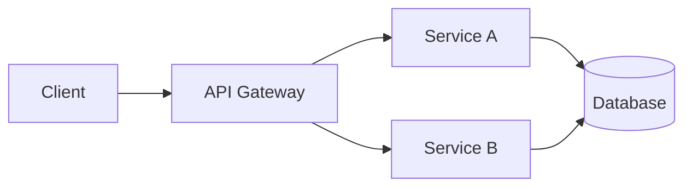

## Why Use Markdown for Presentations?

Traditional presentation software locks you into proprietary file formats, clunky drag-and-drop interfaces, and vendor lock-in. If you're a developer, technical writer, or educator who already writes documentation in Markdown, forcing yourself into a completely different workflow for presentations is inefficient and frustrating.

Markdown-based presentation tools solve this problem. You write your slides the same way you write everything else — in plain text, version-controlled with Git, and renderable into beautiful HTML presentations. The benefits are significant:

- **Version control**: Every change to your presentation is tracked in Git. No more "final_v3_really_final.pptx" confusion.
- **Plain text**: Slides are human-readable, diffable, and mergeable. No binary formats that break over time.
- **Self-hosted**: No dependency on cloud services like Google Slides or PowerPoint Online. Your presentations live on your infrastructure.
- **Developer-friendly**: Syntax highlighting, code execution, LaTeX math, and component imports work out of the box.
- **Export flexibility**: Generate PDFs, standalone HTML files, or serve presentations live from a web server.

In this guide, we compare the three most mature open-source Markdown presentation frameworks available in 2026: **Slidev**, **Reveal.js**, and **Marp**. Each takes a different approach to the problem, and the right choice depends on your workflow, technical stack, and presentation needs.

## Quick Comparison Table

| Feature | Slidev | Reveal.js | Marp |
|---|---|---|---|
| **GitHub Stars** | 45,877 | 71,034 | 11,423 (marp) |
| **Language** | TypeScript (Vue.js) | JavaScript | TypeScript |
| **License** | MIT | MIT | MIT |
| **Latest Release** | v52.14.2 (Apr 2026) | v6.0.1 (Apr 2026) | Active (ecosystem) |
| **Syntax** | Markdown + Vue SFC | HTML + Markdown | Markdown + directives |
| **Live Reload** | Yes (Vite HMR) | Yes (manual setup) | Yes (CLI watch mode) |
| **Code Highlighting** | Prism.js, auto-detect | Highlight.js | Prism.js, built-in |
| **Math/LaTeX** | KaTeX built-in | MathJax plugin | KaTeX built-in |
| **Component System** | Vue.js SFC components | HTML/JS custom elements | Limited (HTML in MD) |
| **Presenter Notes** | Yes, separate panel | Yes, `S` key | Markdown comment blocks |
| **Export to PDF** | Built-in (`slidev export`) | via `decktape` | Built-in (`marp --pdf`) |
| **Recording** | Built-in camera recording | No native support | No native support |
| **[docker](https://www.docker.com/) Support** | Community images | Manual Dockerfile | Official Dockerfile |
| **Best For** | Developers who want rich interactivity | Teams needing maximum customization | Minimalist, fast slide creation |

## Slidev — The Developer's Presentation Framework

[Slidev](https://sli.dev) (Slides for Developers) is a Vue.js-powered presentation framework that treats slides as a full development environment. It uses Vite for hot module replacement, supports Vue single-file components directly in your slides, and includes a built-in presenter mode with camera recording.

### Getting Started with Slidev

Install Slidev globally via npm and create your first presentation:

```bash
# Install Slidev
npm i -g @slidev/cli

# Create a new presentation
mkdir my-presentation && cd my-presentation
slidev init

# Start the dev server with live reload
slidev
```

Your first slide deck lives in `slides.md`:

```markdown
---
theme: default
background: https://source.unsplash.com/collection/94734566/1920x1080
class: text-center
highlighter: shiki
lineNumbers: false
---

# My Technical Presentation

Subtitle and author info

---

## Agenda

- Architecture overview
- Deployment pipeline
- Performance benchmarks

---

## Code Example

```python
def health_check():
    import requests
    response = requests.get("http://api:8080/health")
    return response.status_code == 200
```

---

## Architecture Diagram


```

Slidev's `vite-plugin-md` parses Markdown into Vue components, which means you can embed interactive Vue components directly within slides. This is unique among presentation frameworks.

### Docker Deployment

While Slidev doesn't ship an official Docker image, the community-maintained `tangramor/slidev_docker` image works well for self-hosting:

```yaml
version: "3.8"
services:
  slidev:
    image: tangramor/slidev_docker:latest
    ports:
      - "3030:3030"
    volumes:
      - ./slides:/slidev/workspace
    command: slidev --remote
    restart: unless-stopped
```

Access your presentation at `http://localhost:3030`. The `--remote` flag enables the presenter mode and slide controls from any browser.

### Key Strengths

- **Rich component system**: Import Vue components, use `<script setup>` blocks, and build interactive slides with real data fetching.
- **Built-in recording**: Record your presentation with webcam overlay directly in the browser — no third-party tools needed.
- **Vite-powered**: Instant hot reload, even with large presentations.
- **Theme ecosystem**: Dozens of community themes available via npm.
- **Monaco Editor integration**: Edit slides live in the browser during presentation mode.

## Reveal.js — The HTML Presentation Framework

[Reveal.js](https://revealjs.com) is the oldest and most widely adopted open-source presentation framework. Created by Hakim El Hattab, it has been actively developed since 2011 and powers thousands of conference talks, university lectures, and corporate presentations worldwide.

### Getting Started with Reveal.js

Reveal.js offers multiple installation methods. The quickest path is using their online editor at [slides.com](https://slides.com), but for self-hosted use:

```bash
# Clone the repository
git clone https://github.com/hakimel/reveal.js.git
cd reveal.js

# Install dependencies
npm install

# Start the development server
npm start
```

Alternatively, use Reveal.js via CDN in a standalone HTML file:

```html
<!DOCTYPE html>
<html lang="en">
<head>
  <meta charset="UTF-8">
  <meta name="viewport" content="width=device-width, initial-scale=1.0">
  <title>My Presentation</title>
  <link rel="stylesheet" href="https://cdn.jsdelivr.net/npm/reveal.js@6.0.1/dist/reveal.css">
  <link rel="stylesheet" href="https://cdn.jsdelivr.net/npm/reveal.js@6.0.1/dist/theme/black.css">
</head>
<body>
  <div class="reveal">
    <div class="slides">
      <section>
        <h1>Welcome</h1>
        <p>Self-hosted presentations with Reveal.js</p>
      </section>
      <section>
        <h2>Why Reveal.js?</h2>
        <ul>
          <li>15+ years of active development</li>
          <li>71,000+ GitHub stars</li>
          <li>Runs anywhere HTML runs</li>
        </ul>
      </section>
      <section data-markdown>
        <textarea data-template>
## Markdown Support

Reveal.js supports Markdown content via the markdown plugin.

```bash
docker run -p 8000:8000 my-presentation
```

        </textarea>
      </section>
    </div>
  </div>
  <script src="https://cdn.jsdelivr.net/npm/reveal.js@6.0.1/dist/reveal.js"></script>
  <script src="https://cdn.jsdelivr.net/npm/reveal.js@6.0.1/plugin/markdown/markdown.js"></script>
  <script>
    Reveal.initialize({
      plugins: [ RevealMarkdown ],
      hash: true
    });
  </script>
</body>
</html>
```

### Docker Deployment

Reveal.js presentations are static HTML/CSS/JS — any web server can serve them. Here's a Docker Compose setup using Nginx:

```yaml
version: "3.8"
services:
  presentation:
    image: nginx:alpine
    ports:
      - "8080:80"
    volumes:
      - ./presentation:/usr/share/nginx/html:ro
    restart: unless-stopped
```

Place your `index.html` (with Reveal.js assets) in the `./presentation` directory. The presentation is immediately available at `http://localhost:8080`.

For a development setup with live reload, you can use Node.js:

```yaml
version: "3.8"
services:
  reveal-dev:
    image: node:20-alpine
    working_dir: /app
    ports:
      - "8080:8080"
    volumes:
      - ./:/app
    command: >
      sh -c "npm install && npx serve -l 8080"
    restart: unless-stopped
```

### Key Strengths

- **Mature ecosystem**: 15+ years of development means every edge case has been solved. Extensive documentation and community knowledge.
- **Maximum portability**: Since presentations are plain HTML, they run on any web server, any device, any browser.
- **Plugin architecture**: Rich plugin system for markdown, notes, zoom, search, math, and more.
- **Vertical slides**: Unique nested slide support for organizing content hierarchically.
- **No build step required**: Unlike Slidev and Marp, Reveal.js works as a single HTML file with CDN dependencies.

## Marp — The Minimalist Markdown-to-Slides Ecosystem

[Marp](https://marp.app/) (Markdown Presentation Ecosystem) takes the simplest possible approach: write Markdown, get slides. The core engine, [Marpit](https://github.com/marp-team/marpit), is a skinny framework that converts Markdown with special directives into styled slide HTML.

### Getting Started with Marp

Install Marp CLI globally and start writing:

```bash
# Install Marp CLI
npm i -g @marp-team/marp-cli

# Create your first slide deck
cat > slides.md << 'SLIDES'
---
marp: true
theme: default
paginate: true
---

# Welcome to Marp

Minimalist markdown presentations

---

## Why Marp?

- Write slides the same way you write docs
- Built-in KaTeX math rendering
- Export to PDF, HTML, or PNG
- Theme customization via CSS

---

<!-- _class: lead invert -->

# Big Impact Slide

Use the `<!-- _class: -->` directive
for per-slide styling.

---

## Two-Column Layout

<div class="columns">
<div>

### Column One

Left side content here.

</div>
<div>

### Column Two

Right side content here.

</div>
</div>
SLIDES

# Preview in browser with live reload
marp --watch --preview slides.md

# Export to PDF
marp --pdf slides.md -o presentation.pdf

# Export to standalone HTML
marp --html slides.md -o presentation.html
```

### Docker Deployment

Marp CLI ships with an official Dockerfile, making self-hosting straightforward:

```yaml
version: "3.8"
services:
  marp:
    image: ghcr.io/marp-team/marp-cli:latest
    working_dir: /home/marp/app
    volumes:
      - ./slides:/home/marp/app:ro
    command: >
      sh -c "marp --watch --server --preview false slides.md"
    ports:
      - "8080:8080"
    restart: unless-stopped
```

The `--server` flag starts a built-in HTTP server that serves the rendered HTML with live reload. For static export (no server needed):

```bash
docker run --rm -v $(pwd)/slides:/home/marp/app ghcr.io/marp-team/marp-cli:latest marp slides.md --html -o output.html
```

### Key Strengths

- **Lowest barrier to entry**: If you know Markdown, you know Marp. No HTML, no JavaScript, no framework-specific syntax.
- **Official Docker image**: The only tool in this comparison with an officially maintained Docker image from the project authors.
- **Theme system**: CSS-based theming with scoped styles — create consistent branded presentations.
- **Multiple export formats**: PDF, PPTX (via plugin), HTML, and PNG exports all from the same source file.
- **GitHub Actions integration**: Automatically generate slides from Markdown on every commit push.

## Feature Comparison Deep Dive

### Code Presentation

For technical presentations, code rendering quality matters significantly.

**Slidev** uses Shiki (the same syntax highlighter as VS Code), providing accurate, theme-matched code highlighting with line number support:

```markdown
<!-- Slidev: use {} for line highlighting -->
```ts {2,4-5|7|all}
function process(data: string[]) {
  const filtered = data.filter(d => d.length > 0)
  const mapped = filtered.map(d => d.trim())
  return mapped
}
```
```

**Reveal.js** uses Highlight.js with configuration via the initialization object:

```html
<section data-markdown>
  <textarea data-template>
```python
def deploy():
    """Deploy to production"""
    runner.deploy(environment="production")
```
  </textarea>
</section>
```

**Marp** uses Prism.js and supports code block fencing:

````markdown
```python {2-3}
def deploy():
    """Deploy to production"""
    runner.deploy(environment="production")
```
````

### Math and LaTeX

All three tools support mathematical typesetting, which is essential for academic and scientific presentations.

| Tool | Engine | Inline Syntax | Block Syntax |
|---|---|---|---|
| Slidev | KaTeX | `$E = mc^2$` | `$$\int_0^\infty$$` |
| Reveal.js | MathJax (plugin) | `\(E = mc^2\)` | `\[ \int_0^\infty \]` |
| Marp | KaTeX | `$E = mc^2$` | `$$\int_0^\infty$$` |

### Presenter Mode

| Feature | Slidev | Reveal.js | Marp |
|---|---|---|---|
| Speaker notes | Dedicated panel | `S` key popup | Markdown comments |
| Timer | Built-in | Built-in | None |
| Next slide preview | Yes | Yes | No |
| Camera overlay | Built-in | No | No |
| Laser pointer | Yes | No | No |
| Remote control | Yes (URL-based) | Yes (plugin) | No |

Slidev's presenter mode is the most feature-complete, including camera recording, timer, and the ability to annotate slides in real-time during presentation.

## Which Should You Choose?

### Choose Slidev if:
- You work in the Vue.js or JavaScript ecosystem and want component-driven slides
- You need built-in recording capabilities for conference talks or tutorials
- You want the best developer experience with Vite-powered live reload
- You frequently include interactive demos or live code editing in presentations

### Choose Reveal.js if:
- You need maximum compatibility — presentations must run on any device
- You prefer HTML-based structure over Markdown-first workflow
- You want a 15-year-old project with extensive documentation and community support
- You need vertical/hierarchical slide organization
- You don't want a build step — CDN-based deployment works instantly

### Choose Marp if:
- You want the simplest possible workflow — write Markdown, get slides
- You need official Docker support out of the box
- You want to integrate slide generation into CI/CD pipelines
- You prefer CSS-based theming over framework-specific customization
- Your team already uses Markdown for everything and wants zero learning curve

### Summary Recommendation

For most **developers creating technical presentations**, Slidev offers the richest feature set and best DX. For **teams deploying presentations to diverse audiences** who may access them on any device, Reveal.js's HTML-first approach guarantees compatibility. For **documentation-driven teams** who want slides generated from the same Markdown as their docs, Marp's simplicity and official Docker image make it the pragmatic choice.

For related reading, check out our [self-hosted whiteboard and diagram tools guide](../self-hosted-whiteboard-tools-excalidraw-wbo-drawio-guide/) for visu[wiki.js](https://js.wiki/)entation aids, the [wiki.js vs BookStack vs Outline comparison](../wiki-js-vs-bookstack-vs-outline/) for team documentation, and our [self-hosted note-taking and knowledge management guide](../self-hosted-note-taking-knowledge-management/) for organizing research before building presentations.

## FAQ

### Can I use these presentation tools without an internet connection?

Yes. All three tools support fully offline use. Slidev and Marp bundle their dependencies locally after installation, and Reveal.js can be served from a local directory. Once built, presentations are standalone files that require no network access to display.

### How do I convert existing PowerPoint presentations to these formats?

There is no automatic PowerPoint-to-Markdown converter that preserves formatting perfectly. The recommended approach is to extract content from your existing slides and rewrite them in Markdown. For Reveal.js, the `reveal.js-md` plugin can convert simple Markdown to slides. Marp's `@marp-team/marp-cli` also supports importing basic HTML. Com[plex](https://www.plex.tv/) animations and transitions must be recreated manually.

### Can I export presentations to PDF?

All three tools support PDF export. Slidev uses `slidev export` (built on Playwright), Marp has `marp --pdf` (built-in), and Reveal.js requires the external `decktape` tool (`decktape reveal slides.html output.pdf`). Slidev and Marp's PDF exports are generally more reliable since they're integrated into the core tooling.

### Do these tools support collaborative editing?

Not natively. However, since all three store presentations as plain text files, you can collaborate via Git version control. For real-time collaboration, you could serve the Markdown source through a collaborative editor like [HedgeDoc or Etherpad](../hedgedoc-vs-etherpad-self-hosted-collaborative-editors-guide-2026/) and then render the result. Slidev's Vite dev server also supports remote access with the `--remote` flag.

### What about custom fonts and branding?

All three support custom fonts and branding. Slidev allows importing Google Fonts and custom CSS in the frontmatter or a separate `style.css`. Reveal.js supports custom themes by extending the Sass source files. Marp uses CSS directives (`<!-- _style: -->`) for per-slide styling and a `--theme-set` option for global custom themes. For consistent company branding across multiple presentations, Marp's CSS-based theming is the most straightforward to maintain.

### Can I embed videos in my presentations?

Yes. Slidev supports embedding YouTube/Vimeo URLs and local video files using standard HTML `<video>` tags or Vue components. Reveal.js supports iframe embeds and HTML5 video natively. Marp supports HTML within Markdown blocks, allowing `<video>` and `<iframe>` tags. All three require the presentation to be served over HTTP (not viewed as a local file) for video playback to work correctly.

### Are these tools suitable for large presentations (100+ slides)?

Reveal.js handles large presentations best since it lazy-loads slides and only renders the visible ones. Slidev's Vite build can become slow with 100+ slides, though the dev server remains responsive. Marp's performance depends on the export format — HTML output handles large decks well, but PDF generation can become memory-intensive. For conference-length talks, all three perform adequately.

<script type="application/ld+json">
{
  "@context": "https://schema.org",
  "@type": "TechArticle",
  "headline": "Slidev vs Reveal.js vs Marp: Best Markdown Presentation Tools 2026",
  "description": "Compare Slidev, Reveal.js, and Marp — the top open-source markdown presentation frameworks. Self-host your slides, write in Markdown, and deliver professional presentations without proprietary tools.",
  "datePublished": "2026-04-20",
  "dateModified": "2026-04-20",
  "author": {
    "@type": "Organization",
    "name": "OpenSwap Guide"
  },
  "publisher": {
    "@type": "Organization",
    "name": "OpenSwap Guide",
    "logo": {
      "@type": "ImageObject",
      "url": "https://www.pistack.xyz/logo.png"
    }
  }
}
</script>
