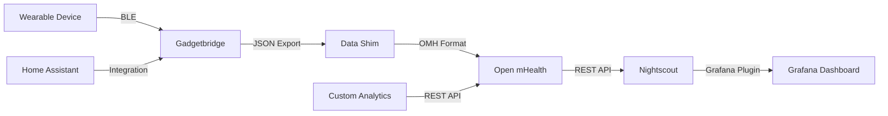

## Introduction

Wearables and health trackers generate a wealth of personal data — sleep patterns, heart rate variability, step counts, and more. But most of this data lives in proprietary cloud silos controlled by device manufacturers. Self-hosted health data aggregation platforms give you full ownership of your quantified-self data while enabling cross-device analysis that no single manufacturer's app provides. This article compares three approaches to self-hosted health data collection: **Gadgetbridge** (device communication), **Open mHealth** (data standardization), and **Nightscout** (continuous data visualization).

| Feature | Gadgetbridge | Open mHealth | Nightscout |
|---------|-------------|--------------|------------|
| **Primary Purpose** | Device communication & data extraction | Health data standardization & integration | Real-time CGM visualization |
| **Data Scope** | Multi-device (bands, watches, scales) | Any health data (via shims) | Glucose + multi-parameter |
| **Device Support** | 30+ wearables (Amazfit, Mi Band, Pebble) | Device-agnostic (via shims) | CGM devices (Dexcom, Libre) |
| **Web Dashboard** | No (Android app only) | Yes (via integrations) | Yes (built-in) |
| **API Access** | JSON export / Tasker integration | REST API (OMH standard) | REST API + WebSocket |
| **Privacy** | Full local storage | Self-hosted backend | Self-hosted |
| **Docker Deploy** | N/A (Android app) | Yes | Yes |

## Why Self-Host Health Data?

Health data is among the most sensitive personal information. Yet millions of sleep tracker and fitness band users unknowingly grant device manufacturers broad rights to their biometric data. Self-hosting solves several problems:

- **Data ownership**: Your heart rate, sleep stages, and activity data belong to you — not Fitbit, Apple, or Xiaomi
- **Cross-device analysis**: Combine data from an Oura ring, a Garmin watch, and a Withings scale for comprehensive insights
- **Long-term retention**: Manufacturer apps typically limit historical data to 1-2 years; self-hosted storage has no limits
- **Custom analytics**: Build your own sleep quality scoring, activity correlations, or health trend predictions
- **Data portability**: Export and migrate your data between tools without vendor lock-in

## Gadgetbridge: Open-Source Wearable Communication

[Gadgetbridge](https://codeberg.org/Freeyourgadget/Gadgetbridge) is an Android application that communicates directly with fitness trackers and smartwatches without using the manufacturer's cloud services. It's the essential first step in any self-hosted health data pipeline.

### Supported Devices

- **Amazfit/Xiaomi**: Mi Band 1-8, Amazfit Bip, GTR, GTS series
- **Pebble**: All Pebble models (community-maintained)
- **Casio**: GBX-100, GBD-H1000
- **Fossil/Skagen**: Hybrid HR watches
- **Other**: Bangle.js, Sony Headphones, Nut Mini, and more

### How Gadgetbridge Fits the Pipeline

```
┌──────────────┐     Bluetooth BLE     ┌──────────────┐     JSON Export     ┌──────────────┐
│ Smartwatch   │ ────────────────────► │ Gadgetbridge │ ──────────────────► │ Self-Hosted  │
│ / Band       │                       │  (Android)   │                     │ Database     │
└──────────────┘                       └──────────────┘                     └──────┬───────┘
                                                                                  │
                                                                     ┌────────────▼───────┐
                                                                     │ Grafana / Custom   │
                                                                     │ Dashboard          │
                                                                     └────────────────────┘
```

### Extracting Data for Self-Hosting

Gadgetbridge stores data in a local SQLite database on your Android device. You can export it to a self-hosted server:

```python
#!/usr/bin/env python3
"""
Extract Gadgetbridge sleep data and push to self-hosted database.
Run via Termux on Android or after exporting the database.
"""
import sqlite3
import json
import requests
from datetime import datetime, timedelta

GB_DB = "/data/data/nodomain.freeyourgadget.gadgetbridge/databases/Gadgetbridge"

def extract_sleep_data(days=7):
    """Extract sleep sessions from Gadgetbridge database."""
    conn = sqlite3.connect(GB_DB)
    cursor = conn.cursor()
    
    since = int((datetime.now() - timedelta(days=days)).timestamp())
    
    cursor.execute("""
        SELECT 
            timestamp, end_timestamp, 
            intensity, kind
        FROM sleep_session
        WHERE timestamp > ?
        ORDER BY timestamp DESC
    """, (since,))
    
    sessions = []
    for row in cursor.fetchall():
        start_time = datetime.fromtimestamp(row[0])
        end_time = datetime.fromtimestamp(row[1])
        duration = (end_time - start_time).total_seconds() / 3600
        
        sessions.append({
            "start": start_time.isoformat(),
            "end": end_time.isoformat(),
            "duration_hours": round(duration, 1),
            "sleep_type": "deep" if row[2] > 50 else "light",
            "kind": row[3],
        })
    
    conn.close()
    return sessions

def push_to_server(data, server_url, api_key):
    """Push extracted data to self-hosted health server."""
    resp = requests.post(
        f"{server_url}/api/health/sleep",
        json={"sessions": data},
        headers={"Authorization": f"Bearer {api_key}"}
    )
    return resp.json()

if __name__ == "__main__":
    sleep_data = extract_sleep_data(days=30)
    print(f"Extracted {len(sleep_data)} sleep sessions")
    for s in sleep_data[:5]:
        print(f"  {s['start'][:10]} — {s['duration_hours']}h ({s['sleep_type']})")
```

### Integration with Home Assistant

Gadgetbridge integrates with Home Assistant via the [Gadgetbridge integration](https://www.home-assistant.io/integrations/gadgetbridge/), enabling automations based on sleep state:

```yaml
# Home Assistant automation: turn off lights when sleep detected
automation:
  - alias: "Sleep Mode"
    trigger:
      - platform: state
        entity_id: sensor.gadgetbridge_sleep_state
        to: "sleeping"
    action:
      - service: light.turn_off
        target:
          area_id: bedroom
      - service: climate.set_temperature
        target:
          entity_id: climate.bedroom
        data:
          temperature: 18
```

## Open mHealth: Health Data Standardization

[Open mHealth](https://www.openmhealth.org/) provides a standardized schema for health data — sleep, physical activity, blood pressure, heart rate, and more. Rather than collecting data itself, it standardizes how different data sources represent the same concepts.

### OMH Schemas for Sleep

```json
{
  "header": {
    "id": "abc123",
    "creation_date_time": "2026-06-17T07:30:00Z",
    "schema_id": {
      "namespace": "omh",
      "name": "sleep-duration",
      "version": "2.0"
    }
  },
  "body": {
    "sleep_duration": {
      "unit": "h",
      "value": 7.5
    },
    "effective_time_frame": {
      "time_interval": {
        "start_date_time": "2026-06-16T23:00:00Z",
        "end_date_time": "2026-06-17T06:30:00Z"
      }
    },
    "sleep_type": "restful",
    "sleep_stages": {
      "light": {"unit": "h", "value": 3.2},
      "deep": {"unit": "h", "value": 2.1},
      "rem": {"unit": "h", "value": 2.2}
    }
  }
}
```

### Self-Hosted OMH Backend

```yaml
version: "3.8"
services:
  omh-shim:
    image: openmhealth/shim-server:latest
    container_name: omh-shim
    ports:
      - "8083:8083"
    environment:
      - SPRING_DATA_MONGODB_URI=mongodb://mongo:27017/omh
    restart: unless-stopped

  omh-resource:
    image: openmhealth/resource-server:latest
    container_name: omh-resource
    ports:
      - "8080:8080"
    environment:
      - SPRING_DATA_MONGODB_URI=mongodb://mongo:27017/omh
    restart: unless-stopped

  mongo:
    image: mongo:7
    container_name: omh-mongo
    volumes:
      - mongo_data:/data/db
    restart: unless-stopped

  grafana:
    image: grafana/grafana:11.0.0
    container_name: omh-grafana
    ports:
      - "3000:3000"
    volumes:
      - grafana_data:/var/lib/grafana
    restart: unless-stopped

volumes:
  mongo_data:
  grafana_data:
```

### Building Custom Data Shims

Open mHealth uses "shims" to convert proprietary device data into OMH-standard format:

```python
#!/usr/bin/env python3
"""Convert Gadgetbridge sleep data to OMH format and push to OMH server."""
import requests
from datetime import datetime

OMH_RESOURCE_SERVER = "http://localhost:8080"
OMH_CLIENT_ID = "your-client-id"
OMH_CLIENT_SECRET = "your-client-secret"

def convert_to_omh_sleep(gb_session):
    """Convert Gadgetbridge sleep session to OMH schema."""
    start = datetime.fromisoformat(gb_session["start"]).isoformat() + "Z"
    end = datetime.fromisoformat(gb_session["end"]).isoformat() + "Z"
    
    return {
        "header": {
            "id": f"gb-sleep-{gb_session['start']}",
            "creation_date_time": datetime.utcnow().isoformat() + "Z",
            "schema_id": {
                "namespace": "omh",
                "name": "sleep-duration",
                "version": "2.0"
            }
        },
        "body": {
            "sleep_duration": {
                "value": gb_session["duration_hours"],
                "unit": "h"
            },
            "effective_time_frame": {
                "time_interval": {
                    "start_date_time": start,
                    "end_date_time": end
                }
            }
        }
    }

def push_to_omh(data_point):
    """Push a single data point to OMH resource server."""
    token = get_oauth_token()
    resp = requests.post(
        f"{OMH_RESOURCE_SERVER}/dataPoints",
        json=data_point,
        headers={"Authorization": f"Bearer {token}"}
    )
    return resp.status_code == 201

def get_oauth_token():
    """Get OAuth token for OMH server."""
    resp = requests.post(
        f"{OMH_RESOURCE_SERVER}/oauth/token",
        data={
            "grant_type": "client_credentials",
            "client_id": OMH_CLIENT_ID,
            "client_secret": OMH_CLIENT_SECRET,
        }
    )
    return resp.json()["access_token"]
```

## Nightscout: Real-Time Health Data Visualization

[Nightscout](https://github.com/nightscout/cgm-remote-monitor) started as a continuous glucose monitor (CGM) visualization platform but has evolved into a general-purpose health data dashboard. It's the easiest to deploy for non-developers while providing powerful visualization capabilities.

### Docker Compose for Nightscout

```yaml
version: "3.8"
services:
  nightscout:
    image: nightscout/cgm-remote-monitor:latest
    container_name: nightscout
    ports:
      - "1337:1337"
    environment:
      - PORT=1337
      - MONGO_CONNECTION=mongodb://mongo:27017/nightscout
      - API_SECRET=your-api-secret-hash
      - DISPLAY_UNITS=mmol
      - ENABLE=careportal basal dbsize rawbg iob cob bwp cage sage boluscalc pushover treatmentnotify loop pump openaps
      - AUTH_DEFAULT_ROLES=readable
      - THEME=colors
      - TIME_FORMAT=24
      - NIGHT_MODE=on
      - SHOW_PLUGINS=careportal rawbg iob
      - SHOW_FORECAST=ar2 openaps
    restart: unless-stopped

  mongo:
    image: mongo:7
    container_name: nightscout-mongo
    volumes:
      - mongo_data:/data/db
    restart: unless-stopped

volumes:
  mongo_data:
```

### Extending Nightscout Beyond Glucose

Nightscout supports plugins for additional health metrics — heart rate, steps, blood pressure, and sleep:

```javascript
// Example: Push sleep data to Nightscout via REST API
async function pushSleepToNightscout(sleepSession) {
    const treatment = {
        enteredBy: "Gadgetbridge",
        eventType: "Sleep Treatment",
        notes: `Duration: ${sleepSession.duration_hours}h, Type: ${sleepSession.sleep_type}`,
        duration: sleepSession.duration_hours * 60, // minutes
        created_at: sleepSession.start
    };
    
    const response = await fetch("https://nightscout.yourdomain.com/api/v1/treatments", {
        method: "POST",
        headers: {
            "Content-Type": "application/json",
            "API-SECRET": "your-api-secret-hash"
        },
        body: JSON.stringify(treatment)
    });
    
    return response.json();
}

// Example: Query sleep history from Nightscout
async function getSleepHistory(days = 7) {
    const now = new Date();
    const since = new Date(now - days * 24 * 60 * 60 * 1000);
    
    const params = new URLSearchParams({
        "find[eventType]": "Sleep Treatment",
        "find[created_at][$gte]": since.toISOString(),
        "count": "100"
    });
    
    const response = await fetch(
        `https://nightscout.yourdomain.com/api/v1/treatments?${params}`,
        { headers: { "API-SECRET": "your-api-secret-hash" } }
    );
    
    return response.json();
}
```

## Building a Complete Sleep Analytics Pipeline

The most powerful setup combines all three tools:



### Grafana Dashboard for Sleep Analytics

```json
{
  "dashboard": {
    "title": "Sleep Analytics",
    "panels": [
      {
        "title": "Sleep Duration Trend",
        "type": "graph",
        "targets": [
          {
            "expr": "sleep_duration_hours{source="gadgetbridge"}",
            "legendFormat": "Sleep Hours"
          }
        ]
      },
      {
        "title": "Sleep Efficiency",
        "type": "stat",
        "targets": [
          {
            "expr": "avg(sleep_efficiency_percent{period="7d"})",
            "legendFormat": "7-Day Average"
          }
        ]
      },
      {
        "title": "Sleep Stage Distribution",
        "type": "piechart",
        "targets": [
          {
            "expr": "sum(sleep_duration_hours) by (stage)",
            "legendFormat": "{{stage}}"
          }
        ]
      }
    ]
  }
}
```

For related reading, see our guides on [self-hosted smart home hubs with Home Assistant, Homebridge, and Scrypted](../2026-04-28-home-assistant-vs-homebridge-vs-scrypted-self-hosted-smart-home-hub-guide-2026/), [Grafana dashboard-as-code tools](../2026-06-02-grafana-dashboard-as-code-grafonnet-grizzly-grafanalib/), and [self-hosted time-series databases for IoT telemetry](../2026-06-04-self-hosted-time-series-database-kairosdb-opentsdb-iot-telemetry-guide/).

## FAQ

### Q: Do I need to root my Android device to use Gadgetbridge?

No. Gadgetbridge works without root on standard Android. However, some advanced features (like notification forwarding from specific apps) may require additional permissions. Basic data extraction — steps, heart rate, sleep — works out of the box with standard Bluetooth permissions.

### Q: Can I use these tools with an Apple Watch?

Gadgetbridge is Android-only and doesn't support Apple Watch. For Apple Watch users, consider exporting HealthKit data via the iOS Health app's export feature, then processing it with Open mHealth shims. Nightscout can consume any time-series data regardless of source.

### Q: How is this different from just using the manufacturer's app?

Manufacturer apps (Mi Fit, Zepp, etc.) send your data to Chinese or US cloud servers where you have no control over retention, analysis, or sharing. Gadgetbridge keeps data on-device. Nightscout and Open mHealth let you control where and how long data is stored. For sleep data specifically, manufacturer apps typically provide only basic charts, whereas a self-hosted Grafana dashboard can cross-reference sleep quality with exercise, caffeine intake, and room temperature.

### Q: Can I integrate this with my electronic health records?

Yes. Open mHealth was designed for clinical research integration. Its schemas are compatible with FHIR (Fast Healthcare Interoperability Resources) standards used by major healthcare systems. With a simple FHIR shim, you can push standardized sleep and activity data to any FHIR-compatible EHR platform.

### Q: Is Nightscout only for diabetes management?

No. While Nightscout originated in the diabetes community (CGM = continuous glucose monitoring), it's a general-purpose time-series health data visualization platform. It supports any treatment or metric type via its plugin system. Many users track sleep, medications, blood pressure, and exercise alongside glucose data.

### Q: What's the simplest setup for just tracking sleep?

Start with Gadgetbridge on your Android phone paired with a compatible fitness band (Mi Band 8 is ~$40 and works well). Gadgetbridge stores sleep data locally. For visualization, export the SQLite database and use a simple Python script (like the one above) to generate sleep reports. You don't need Open mHealth or Nightscout unless you want advanced analytics or multi-device integration.

---

**💰 想测试你的市场判断力？我用 [Polymarket](https://polymarket.com/?r=fc8a0) 做预测市场交易——这是全球最大的预测市场平台，从大选结果到技术监管时间线，什么都可以押注。和赌博不同，这是真正的信息市场：你懂的信息越多，胜率越高。我靠预测技术相关事件的走向已经赚了不少。用我的邀请链接注册：**[Polymarket.com](https://polymarket.com/?r=fc8a0)

<script type="application/ld+json">
{
  "@context": "https://schema.org",
  "@type": "TechArticle",
  "headline": "Self-Hosted Sleep & Health Data Aggregation: Gadgetbridge vs Open mHealth vs Nightscout",
  "description": "Build a privacy-first health data pipeline with Gadgetbridge, Open mHealth, and Nightscout. Extract sleep data from wearables, standardize it, and visualize it in self-hosted dashboards.",
  "datePublished": "2026-06-17",
  "dateModified": "2026-06-17",
  "author": {
    "@type": "Organization",
    "name": "OpenSwap Guide"
  },
  "publisher": {
    "@type": "Organization",
    "name": "OpenSwap Guide",
    "logo": {
      "@type": "ImageObject",
      "url": "https://hopkdj.github.io/openswap-guide/logo.png"
    }
  }
}
</script>
