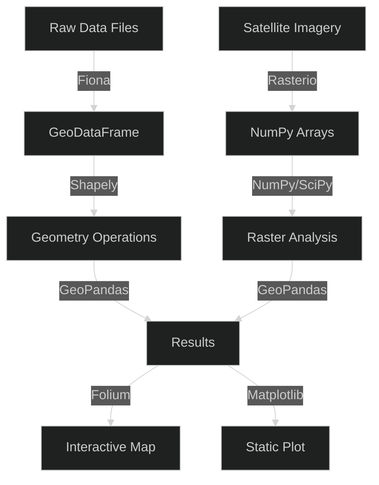

## Introduction

Geospatial data processing has become essential across industries — from urban planning and environmental monitoring to logistics optimization and real estate analytics. Python has emerged as the dominant language for geospatial workflows thanks to a rich ecosystem of open-source libraries that handle vector geometries, raster analysis, file format conversion, and interactive mapping.

This article compares five foundational Python geospatial libraries — **GeoPandas**, **Shapely**, **Fiona**, **Rasterio**, and **Folium** — covering their capabilities, integration patterns, and ideal use cases. Whether you are analyzing satellite imagery, building a location-based service, or creating interactive data dashboards with maps, understanding these tools will accelerate your geospatial development.

## Feature Comparison

| Feature | GeoPandas | Shapely | Fiona | Rasterio | Folium |
|---------|-----------|---------|-------|----------|--------|
| **GitHub Stars** | ~4,600 | ~3,900 | ~1,200 | ~2,300 | ~6,900 |
| **Primary Use** | Vector analysis | Geometry ops | File I/O | Raster analysis | Web maps |
| **Data Model** | DataFrame | Geometric objects | OGR/GDAL wrapper | GDAL wrapper | Leaflet.js |
| **CRS Handling** | ✅ | ❌ | ✅ | ✅ | ❌ |
| **Spatial Joins** | ✅ | ❌ | ❌ | ❌ | ❌ |
| **Raster Support** | ❌ | ❌ | ❌ | ✅ Full | ❌ |
| **Interactive Maps** | ✅ (via explore) | ❌ | ❌ | ❌ | ✅ Advanced |
| **License** | BSD-3 | BSD-3 | BSD-3 | BSD-3 | MIT |
| **Last Update** | Active | Active | Active | Active | Active |

## GeoPandas: DataFrames with Spatial Superpowers

GeoPandas extends Pandas DataFrames with a `geometry` column, enabling spatial operations on tabular data. It is the central hub of the Python geospatial ecosystem — most analysis workflows start by loading data into a GeoDataFrame.

### Installation and Basic Usage

```bash
pip install geopandas
```

```python
import geopandas as gpd
import matplotlib.pyplot as plt

# Load a built-in world map dataset
world = gpd.read_file(gpd.datasets.get_path('naturalearth_lowres'))

# Filter for a continent
europe = world[world['continent'] == 'Europe']

# Calculate area in square kilometers
europe['area_km2'] = europe.geometry.area / 1e6

# Plot with population coloring
fig, ax = plt.subplots(1, 1, figsize=(12, 8))
europe.plot(column='pop_est', ax=ax, legend=True,
            legend_kwds={'label': 'Population Estimate'})
ax.set_title('European Countries by Population')
plt.savefig('europe_population.png', dpi=150)
```

### Spatial Join Operations

```python
import geopandas as gpd
from shapely.geometry import Point

# Create point data
cities = gpd.GeoDataFrame({
    'city': ['Paris', 'London', 'Berlin'],
    'geometry': [Point(2.35, 48.85), Point(-0.12, 51.50), Point(13.40, 52.52)]
}, crs='EPSG:4326')

# Load country boundaries
countries = gpd.read_file(gpd.datasets.get_path('naturalearth_lowres'))

# Spatial join: find which country each city belongs to
cities_with_country = gpd.sjoin(cities, countries[['name', 'geometry']], how='left')
print(cities_with_country[['city', 'name']])
```

GeoPandas supports spatial indexing via `sindex` (R-tree), making spatial join operations efficient even on datasets with millions of geometries. The `explore()` method generates interactive Leaflet maps directly in Jupyter notebooks, bridging the gap between analysis and visualization.

## Shapely: The Geometry Engine

Shapely is the low-level geometry library that GeoPandas builds upon. It provides Python objects for Points, LineStrings, Polygons, and Multi-geometries, with operations like intersection, union, buffer, and convex hull. Every geometry column in a GeoDataFrame stores Shapely objects.

```bash
pip install shapely
```

```python
from shapely.geometry import Point, Polygon, LineString
from shapely.ops import unary_union

# Create geometries
point = Point(0, 0)
polygon = Polygon([(10, 0), (10, 10), (0, 10), (0, 0)])

# Buffer operation
buffered_point = point.buffer(15)

# Check spatial relationships
print(f"Point within polygon: {point.within(polygon)}")  # True
print(f"Point within buffered area: {point.within(buffered_point)}")  # True

# Boolean operations
square1 = Polygon([(0, 0), (5, 0), (5, 5), (0, 5)])
square2 = Polygon([(3, 3), (8, 3), (8, 8), (3, 8)])
intersection = square1.intersection(square2)
print(f"Intersection area: {intersection.area}")  # 4.0
```

### Advanced Geometry Validation

```python
from shapely.geometry import Polygon
from shapely.validation import explain_validity

# Create an invalid polygon (self-intersecting bow-tie)
invalid_poly = Polygon([(0, 0), (1, 1), (0, 1), (1, 0)])
print(explain_validity(invalid_poly))
# Output: "Self-intersection[0.5 0.5]"

# Fix with buffer(0) trick
fixed_poly = invalid_poly.buffer(0)
print(f"Fixed geometry type: {type(fixed_poly).__name__}")
# Output: MultiPolygon
```

Shapely 2.0 (released 2022) brought a complete rewrite using the GEOS C library via PyGEOS, delivering 2-5x speedups for common operations. It remains the foundation that every other Python geospatial library relies on for geometry manipulation.

## Fiona: File Format Bridge

Fiona is a minimal, Pythonic wrapper around the OGR library (part of GDAL) that reads and writes geospatial vector file formats — Shapefiles, GeoJSON, GeoPackage, KML, and dozens more. It is what GeoPandas uses internally for file I/O.

```bash
pip install fiona
```

### Reading GeoJSON

```python
import fiona

with fiona.open('regions.geojson') as src:
    print(f"CRS: {src.crs}")
    print(f"Schema: {src.schema}")
    print(f"Number of features: {len(src)}")

    for feature in src[:3]:
        props = feature['properties']
        geom_type = feature['geometry']['type']
        print(f"  {props.get('name', 'unnamed')} ({geom_type})")
```

### Writing GeoPackage

```python
import fiona
from fiona.crs import from_epsg

schema = {
    'geometry': 'Point',
    'properties': {'name': 'str', 'population': 'int'}
}

with fiona.open('cities.gpkg', 'w',
                driver='GPKG',
                schema=schema,
                crs=from_epsg(4326)) as dst:
    dst.write({
        'geometry': {'type': 'Point', 'coordinates': [116.40, 39.90]},
        'properties': {'name': 'Beijing', 'population': 21540000}
    })
    dst.write({
        'geometry': {'type': 'Point', 'coordinates': [139.69, 35.69]},
        'properties': {'name': 'Tokyo', 'population': 13960000}
    })
```

Fiona's streaming reader processes large files efficiently without loading everything into memory. For data pipelines that need to convert between geospatial formats (e.g., Shapefile → GeoJSON for web APIs), Fiona is the most reliable and lightweight choice.

## Rasterio: Raster Data Analysis

Rasterio provides Pythonic access to geospatial raster data — satellite imagery, digital elevation models (DEMs), land cover classifications, and other gridded data. It wraps GDAL's raster functionality with a clean, NumPy-friendly API.

```bash
pip install rasterio
```

### Reading and Visualizing Satellite Imagery

```python
import rasterio
import numpy as np
import matplotlib.pyplot as plt

with rasterio.open('sentinel2_band4.tif') as src:
    # Read the raster band as a NumPy array
    band = src.read(1)

    # Get georeferencing metadata
    print(f"CRS: {src.crs}")
    print(f"Bounds: {src.bounds}")
    print(f"Resolution: {src.res}")

    # Visualization
    plt.figure(figsize=(10, 8))
    plt.imshow(band, cmap='viridis')
    plt.colorbar(label='Reflectance')
    plt.title('Sentinel-2 Band 4 (Red)')
    plt.show()
```

### Raster Math and Analysis

```python
import rasterio
import numpy as np

# Calculate NDVI from Red and NIR bands
with rasterio.open('red.tif') as red_src, \
     rasterio.open('nir.tif') as nir_src:

    red = red_src.read(1).astype('float32')
    nir = nir_src.read(1).astype('float32')

    # Avoid division by zero
    ndvi = np.where(
        (nir + red) > 0,
        (nir - red) / (nir + red),
        -999
    )

    # Save output with georeferencing from input
    profile = red_src.profile
    profile.update(dtype='float32', count=1)
    with rasterio.open('ndvi.tif', 'w', **profile) as dst:
        dst.write(ndvi, 1)
```

Rasterio's windowed reading (`src.read(window=Window(...))`) enables processing of massive rasters that exceed available memory — it loads only the required tile into a NumPy array, making it suitable for processing satellite imagery covering entire countries.

## Folium: Interactive Web Maps

Folium bridges Python data analysis and interactive web visualization by generating Leaflet.js maps. It integrates naturally with GeoPandas, allowing you to visualize spatial analysis results on interactive slippy maps with markers, choropleths, heatmaps, and custom popups.

```bash
pip install folium
```

### Basic Map with Markers

```python
import folium

m = folium.Map(location=[39.90, 116.40], zoom_start=12)

folium.Marker(
    [39.916, 116.397],
    popup='Forbidden City',
    tooltip='Click for details',
    icon=folium.Icon(color='red', icon='info-sign')
).add_to(m)

folium.CircleMarker(
    [39.904, 116.407],
    radius=50,
    popup='Tiananmen Square',
    color='#3186cc',
    fill=True,
    fill_color='#3186cc'
).add_to(m)

m.save('beijing_map.html')
```

### Choropleth with GeoPandas

```python
import geopandas as gpd
import folium

# Load data
world = gpd.read_file(gpd.datasets.get_path('naturalearth_lowres'))

# Create choropleth map
m = folium.Map(location=[20, 0], zoom_start=2)
folium.Choropleth(
    geo_data=world,
    name='choropleth',
    data=world,
    columns=['name', 'gdp_md_est'],
    key_on='feature.properties.name',
    fill_color='YlOrRd',
    fill_opacity=0.7,
    line_opacity=0.2,
    legend_name='GDP (Million USD)'
).add_to(m)

folium.LayerControl().add_to(m)
m.save('world_gdp_map.html')
```

Folium is ideal for creating shareable, interactive map outputs from geospatial analysis — the HTML files it produces can be embedded in web pages, dashboards, or shared as standalone files without requiring a server backend.

## Integration Patterns: A Typical Geospatial Pipeline

In production workflows, these libraries work together as layers:



This layered architecture allows each library to focus on its strength: Fiona for I/O, Shapely for geometry math, Rasterio for raster processing, GeoPandas for the tabular analysis layer, and Folium for interactive output.

## Why Use Python Geospatial Libraries?

Data ownership matters in geospatial analysis. When you process location data through cloud-based GIS platforms, your organization's sensitive location intelligence — customer routes, facility locations, resource distributions — flows through third-party servers. Running geospatial analysis locally with Python libraries keeps your spatial data under your control, enables reproducible research with version-controlled code, and eliminates per-seat licensing costs that proprietary GIS software imposes. For developers already working with Python-based data processing pipelines, see our [Python logging libraries guide](../2026-07-01-python-logging-libraries-loguru-structlog-logbook-jsonlogger-picologging/) for observability in production geospatial services. For structured data handling that often precedes spatial analysis, our [Python ORM libraries comparison](../2026-07-01-python-orm-libraries-sqlalchemy-peewee-tortoise-ponyorm-sqlmodel/) covers database integration patterns. For working with JSON-based GeoJSON APIs, see our [JSON parser libraries guide](../2026-06-19-self-hosted-json-parser-libraries-simdjson-rapidjson-orjson-ultrajson/).

<script type="application/ld+json">
{
  "@context": "https://schema.org",
  "@type": "TechArticle",
  "headline": "Python Geospatial Processing Libraries: GeoPandas vs Shapely vs Fiona vs Rasterio vs Folium",
  "description": "In-depth comparison of five core Python geospatial libraries — GeoPandas, Shapely, Fiona, Rasterio, and Folium — with code examples, integration patterns, and use-case guidance for vector analysis, raster processing, and interactive mapping.",
  "datePublished": "2026-07-01",
  "dateModified": "2026-07-01",
  "author": {
    "@type": "Organization",
    "name": "OpenSwap Guide"
  },
  "publisher": {
    "@type": "Organization",
    "name": "OpenSwap Guide",
    "logo": {
      "@type": "ImageObject",
      "url": "https://hopkdj.github.io/openswap-guide/logo.png"
    }
  }
}
</script>

## FAQ

### Q: Do I need to install GDAL separately for these libraries to work?

**A:** Yes — **Fiona** and **Rasterio** both depend on GDAL (Geospatial Data Abstraction Library), which must be installed at the system level. On Ubuntu/Debian: `apt-get install libgdal-dev`. On macOS: `brew install gdal`. **GeoPandas** inherits this dependency through its use of Fiona for file I/O. **Shapely** and **Folium** do not require GDAL.

### Q: Can I process satellite imagery larger than available RAM?

**A:** Yes — **Rasterio** supports windowed reading, which loads only the required tile (subset) of a raster into memory as a NumPy array. Use `src.read(window=Window(col_off, row_off, width, height))` to process massive GeoTIFF files in chunks. Combined with NumPy's efficient array operations, this enables processing of multi-gigabyte satellite scenes on modest hardware.

### Q: Which library should I use for interactive web maps?

**A:** **Folium** is the go-to choice for interactive web maps in Python. It generates Leaflet.js maps as HTML files that can be embedded in web applications, Jupyter notebooks, or shared as standalone files. For more advanced dashboards, combine Folium with **GeoPandas** (for data processing) and **Streamlit** or **Dash** (for the application framework).

### Q: How does GeoPandas handle coordinate reference systems (CRS)?

**A:** GeoPandas stores CRS information in the `.crs` attribute of GeoDataFrames and handles reprojection via `to_crs()`. Under the hood, it uses **pyproj** (a PROJ binding) for coordinate transformations. Always ensure your CRS is set correctly — mismatched CRS between layers is the most common source of geospatial bugs (e.g., points in WGS84 attempted to intersect with a polygon in UTM).

### Q: What's the difference between Shapely and GeoPandas for geometry operations?

**A:** **Shapely** operates on individual geometry objects (points, polygons, lines) — it is Python's binding to the GEOS C++ geometry engine. **GeoPandas** extends Pandas DataFrames with geometry columns and provides vectorized spatial operations (spatial joins, overlays, dissolves) on entire tables. In practice, GeoPandas calls Shapely under the hood for the actual geometry math. Use Shapely directly when working with single geometries; use GeoPandas for dataset-level spatial analysis.

---

**💰 想测试你的市场判断力？我用 [Polymarket](https://polymarket.com/?r=fc8a0) 做预测市场交易——这是全球最大的预测市场平台，从大选结果到技术监管时间线，什么都可以押注。和赌博不同，这是真正的信息市场：你懂的信息越多，胜率越高。我靠预测技术相关事件的走向已经赚了不少。用我的邀请链接注册：**[Polymarket.com](https://polymarket.com/?r=fc8a0)
