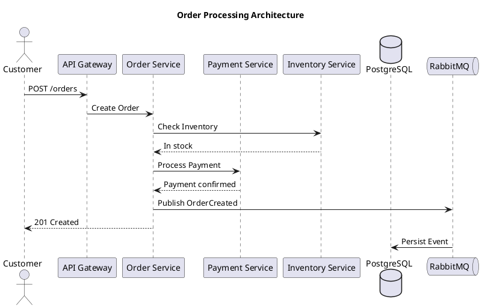
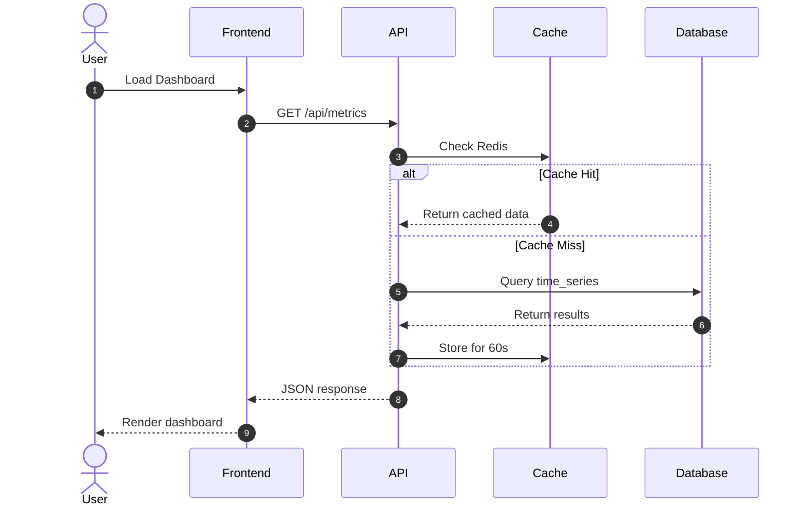
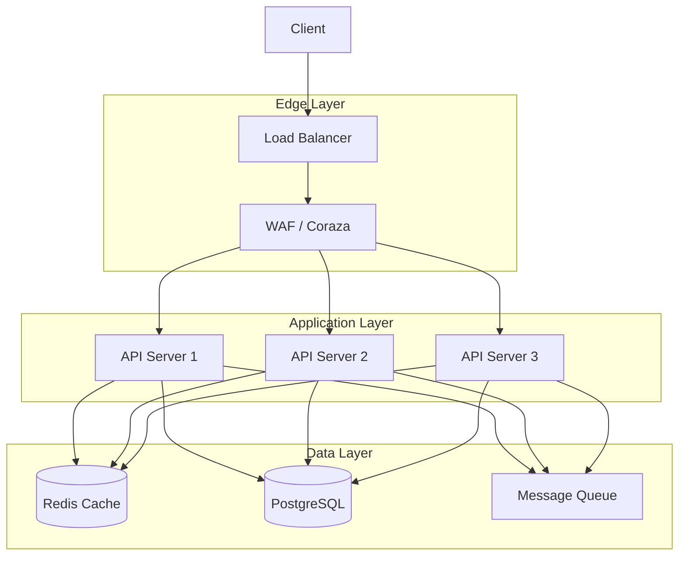
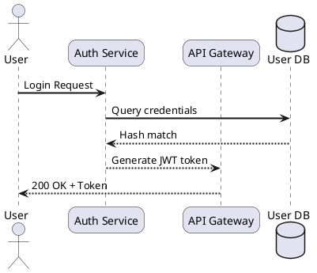

Diagrams are essential for technical documentation, architecture reviews, and knowledge sharing. But relying on cloud-based diagram generators means your proprietary system designs, internal API flows, and infrastructure layouts are sent to third-party servers. Self-hosted text-to-diagram platforms solve this problem entirely: you keep your diagrams in version-controlled text files, render them on your own hardware, and never expose sensitive architecture details to external services.

## Why Self-Host Your Diagram Generator

Cloud diagram tools like Lucidchart, Draw.io Cloud, or the PlantUML web server require you to send your diagram definitions to remote servers. For teams working on:

- **Internal infrastructure** — network topologies, VPC layouts, and service mesh configurations
- **Proprietary architectures** — system designs that represent competitive advantages
- **Compliance-restricted environments** — healthcare, finance, and government systems with data residency requirements
- **Offline documentation** — wiki systems running in air-gapped or restricted networks

Self-hosting eliminates the data exfiltration risk, works without internet connectivity, and integrates directly into CI/CD pipelines for automated diagram generation. The tools discussed here are all open-source, render locally, and produce publication-quality output in SVG, PNG, and PDF formats.

## The Three Contenders

| Feature | Kroki | PlantUML Server | Mermaid |
|---|---|---|---|
| **Language support** | 30+ diagram types | 15+ diagram types | 15+ diagram types |
| **Architecture** | Unified API gateway | Standalone server | JavaScript library |
| **Multi-engine** | Yes (PlantUML, Mermaid, Graphviz, etc.) | Single engine (PlantUML) | Single engine (Mermaid) |
| **REST API** | Yes | Yes | No (client-side only) |
| **[docker](https://www.docker.com/) support** | Official image | Official image | Official image |
| **CI/CD friendly** | Excellent (HTTP API) | Excellent (CLI + server) | Good (CLI tool) |
| **Language syntax** | Depends on engine | Custom DSL | Markdown-like |
| **Learning curve** | Medium (multiple syntaxes) | Medium (custom syntax) | Low (markdown-friendly) |
| **Output formats** | SVG, PNG, PDF, ASCII | SVG, PNG, PDF, ASCII | SVG, PNG |
| **License** | AGPL-3.0 | Apache-2.0 | MIT |

## PlantUML Server: The Veteran

PlantUML has been the workhorse of text-based diagramming since 2009. It uses a custom domain-specific language that reads almost like pseudocode and supports UML diagrams, architecture diagrams, Gantt charts, network diagrams, and more.

### Installation

Run the PlantUML server as a Docker container. It uses Java under the hood, so the official image includes the JVM:

```bash
docker run -d \
  --name plantuml-server \
  -p 8080:8080 \
  plantuml/plantuml-server:jetty
```

For a production setup with persistent GraphViz cache:

```yaml
# docker-compose.yml
version: "3.8"
services:
  plantuml:
    image: plantuml/plantuml-server:jetty
    container_name: plantuml-server
    ports:
      - "8080:8080"
    environment:
      - PLANTUML_LIMIT_SIZE=32768
      - BASE_URL=https://diagrams.example.com
    volumes:
      - plantuml-cache:/tmp/plantuml-cache
    restart: unless-stopped

  # Optional: reverse proxy with Caddy
  caddy:
    image: caddy:latest
    ports:
      - "443:443"
    volumes:
      - ./Caddyfile:/etc/caddy/Caddyfile
    restart: unless-stopped

volumes:
  plantuml-cache:
```

```caddyfile
# Caddyfile
diagrams.example.com {
  reverse_proxy plantuml:8080
}
```

### Usage Example

Write your diagram in a `.puml` file:



Render via the CLI or the web interface:

```bash
# CLI rendering to PNG
plantuml -tpng architecture.puml

# CLI rendering to SVG
plantuml -tsvg architecture.puml

# Batch render all .puml files in a directory
plantuml -tpng docs/diagrams/*.puml
```

The server exposes a REST API at `http://localhost:8080/plantuml/png/{encoded}` where `{encoded}` is the URL-safe deflate-encoded diagram source. Libraries exist for Python, Go, and Node.js to encode and submit diagrams programmatically.

### Integrations

PlantUML integrates with **Obsidian** (via the PlantUML plugin), **VS Code** (official extension), **Markdown editors** (via fenced code blocks), and **CI/CD pipelines**. Most static site generators have PlantUML plugins that render diagrams at build time.

```python
# CI/CD: render diagrams during Hugo site build
import subprocess
import os

diagram_dir = "content/posts/diagrams/"
for filename in os.listdir(diagram_dir):
    if filename.endswith(".puml"):
        filepath = os.path.join(diagram_dir, filename)
        subprocess.run(["plantuml", "-tsvg", filepath], check=True)
```

## Mermaid: The Markdown-Friendly Option

Mermaid is a JavaScript-based diagramming library that uses syntax closely resembling Markdown. It gained massive adoption after GitHub, GitLab, and Notion integrated it natively. Unlike PlantUML, Mermaid renders client-side in browsers, making it ideal for web-based documentation.

### Installation

Mermaid can run in three modes: as a browser script, as a CLI tool, or as a Docker container.

```bash
# Install the CLI globally
npm install -g @mermaid-js/mermaid-cli

# Or use Docker (no npm needed)
docker run --rm -v "$(pwd)":/data minlag/mermaid-cli \
  -i /data/diagram.mmd -o /data/diagram.svg
```

### Usage Example

Mermaid syntax is intuitive for anyone familiar with Markdown:



For architecture diagrams:



### CI/CD Pipeline Integration

Generate diagrams automatically during your build process:

```yaml
# .github/workflows/diagrams.yml
name: Render Mermaid Diagrams
on:
  push:
    paths:
      - "**/*.mmd"

jobs:
  render:
    runs-on: ubuntu-latest
    steps:
      - uses: actions/checkout@v4

      - name: Install Puppeteer and Mermaid CLI
        run: npm install -g @mermaid-js/mermaid-cli

      - name: Render all diagrams
        run: |
          mkdir -p static/diagrams
          for file in $(find diagrams -name "*.mmd"); do
            name=$(basename "$file" .mmd)
            mmdc -i "$file" -o "static/diagrams/${name}.svg" -t dark
          done

      - uses: stefanzweifel/git-auto-commit-action@v5
        with:
          commit_message: "Auto-generate diagrams [skip ci]"
          file_pattern: "static/diagrams/*.svg"
```

### Mermaid Live Server (Self-Hosted)

You can self-host the Mermaid live editor for your team:

```bash
docker run -d \
  --name mermaid-live \
  -p 3000:3000 \
  ghcr.io/mermaid-js/mermaid-live-editor:latest
```

## Kroki: The Universal Diagram API

Kroki is the most ambitious of the three — a unified API that supports over 30 diagram types through a single endpoint. It wraps PlantUML, Mermaid, GraphViz, BPMN, Excalidraw, DBML, WaveDrom, and many more engines behind one consistent interface.

### Why Choose Kroki

The killer feature is **consolidation**. Instead of running separate servers for PlantUML, Mermaid, and GraphViz, you run one Kroki instance that handles all of them. Your documentation can mix diagram types without any infrastructure changes.

### Installation

```yaml
# docker-compose.yml
version: "3.8"
services:
  kroki:
    image: yuzutech/kroki:0.27.0
    container_name: kroki
    ports:
      - "8000:8000"
    environment:
      - KROKI_PLANTUML_HOST=plantuml:8080
      - KROKI_MERMAID_HOST=mermaid:8080
      - KROKI_BPMN_HOST=bpmn:8080
      - KROKI_MAX_URI_LENGTH=8000
    restart: unless-stopped
    depends_on:
      - plantuml
      - mermaid
      - bpmn

  plantuml:
    image: yuzutech/kroki-plantuml:0.27.0
    container_name: kroki-plantuml
    restart: unless-stopped

  mermaid:
    image: yuzutech/kroki-mermaid:0.27.0
    container_name: kroki-mermaid
    environment:
      - KROKI_MERMAID_PORT=8080
    restart: unless-stopped

  bpmn:
    image: yuzutech/kroki-bpmn:0.27.0
    container_name: kroki-bpmn
    restart: unless-stopped

  # Reverse proxy
  caddy:
    image: caddy:latest
    ports:
      - "443:443"
    volumes:
      - ./Caddyfile:/etc/caddy/Caddyfile
      - caddy-data:/data
    restart: unless-stopped

volumes:
  caddy-data:
```

### API Usage

Kroki's API is straightforward. Encode your diagram text, then request the output format:

```bash
# Encode diagram text to base64, then URL-safe deflate
DIAGRAM='@startuml\nAlice -> Bob: Hello\n@enduml'
ENCODED=$(echo -n "$DIAGRAM" | python3 -c "
import sys, base64, zlib
data = sys.stdin.buffer.read()
compressed = zlib.compress(data, 9)
print(base64.urlsafe_b64encode(compressed).decode())
")

# Request PNG output
curl -o diagram.png "http://localhost:8000/plantuml/png/${ENCODED}"

# Request SVG output (better for web)
curl -o diagram.svg "http://localhost:8000/plantuml/svg/${ENCODED}"
```

Kroki also supports POST requests for large diagrams:

```bash
curl -X POST "http://localhost:8000/mermaid/svg" \
  -H "Content-Type: text/plain" \
  --data-binary @architecture.mmd \
  -o architecture.svg
```

### Supported Diagram Types

Kroki supports these diagram engines out of the box:

| Engine | Diagram Types |
|---|---|
| PlantUML | Sequence, Use Case, Class, Activity, Component, State, Object, Deployment, Timing, Gantt, MindMap, Network, Salt/UI |
| Mermaid | Flowchart, Sequence, Class, State, ER, Gantt, Pie, Quadrant, GitGraph, C4 |
| GraphViz | DOT, Neato, Twopi, Circo, FDP, SFD |
| BPMN | Business Process Model and Notation |
| Excalidraw | Hand-drawn style whiteboard diagrams |
| DBML | Database schema diagrams |
| WaveDrom | Digital timing diagrams |
| Structurizr | C4 architecture diagrams |
| Ditaa | ASCII art to diagrams |
| Symbolator | VHDL/Verilog component diagrams |
| TikZ | LaTeX-quality vector graphics |
| ByteField | Byte field structure diagrams |
| Erd | Entity-relationship diagrams |
| GraphViz | DOT language graphs |

## Practical Integration Patterns

### Hugo Static Site Integration

For Hugo sites using a dark theme, integrate diagrams that render at build time:

```toml
# config.toml — enable diagram processing
[markup]
  [markup.goldmark]
    [markup.goldmark.parser]
      [markup.goldmark.parser.attribute]
        block = true
    [markup.goldmark.renderer]
      unsafe = true
```

Use a Hugo shortcode for Kroki diagrams:

```html
<!-- layouts/shortcodes/kroki.html -->
{{ $engine := .Get "engine" | default "plantuml" }}
{{ $format := .Get "format" | default "svg" }}
{{ $content := trim .Inner "\n" }}
{{ $encoded := $content | base64Encode }}

```

Usage in content:

```markdown

sequenceDiagram
    Client->>Server: POST /api/data
    Server->>Database: INSERT record
    Database-->>Server: Success
    Server-->>Client: 201 Created

```

### Obsidian Integration

For Obsidian vaults running self-hosted diagram servers:

```markdown
<!-- PlantUML block (rendered via Obsidian plugin pointing to your server) -->

```

### Documentation-as-Code Workflow

Store all diagrams alongside your source code:

```
my-project/
├── docs/
│   ├── diagrams/
│   │   ├── architecture.mmd      # Mermaid source
│   │   ├── sequence-diagram.puml # PlantUML source
│   │   └── network-topology.dot  # GraphViz source
│   └── architecture.md            # References diagrams
├── scripts/
│   └── render-diagrams.sh         # CI build script
└── Makefile
```

```bash
#!/bin/bash
# render-diagrams.sh — run in CI/CD
set -euo pipefail

OUTPUT_DIR="docs/static/diagrams"
KROKI_URL="${KROKI_URL:-http://localhost:8000}"

mkdir -p "$OUTPUT_DIR"

# Render Mermaid diagrams
for f in docs/diagrams/*.mmd; do
  name=$(basename "$f" .mmd)
  curl -s "$KROKI_URL/mermaid/svg" \
    -H "Content-Type: text/plain" \
    --data-binary @"$f" \
    > "$OUTPUT_DIR/${name}.svg"
done

# Render PlantUML diagrams
for f in docs/diagrams/*.puml; do
  name=$(basename "$f" .puml)
  content=$(cat "$f" | tr '\n' '\\n')
  encoded=$(python3 -c "
import base64, zlib, sys
data = open('$f', 'rb').read()
encoded = base64.urlsafe_b64encode(zlib.compress(data)).decode()
print(encoded)
")
  curl -s "$KROKI_URL/plantuml/svg/${encoded}" > "$OUTPUT_DIR/${name}.svg"
done

echo "Rendered $(ls "$OUTPUT_DIR"/*.svg | wc -l) diagrams"
```

### Pre-commit Hook for Diagram Validation

Validate diagrams before they land in your repository:

```bash
#!/bin/bash
# .husky/validate-diagrams.sh
# Run as a pre-commit hook to catch syntax errors early

errors=0

# Validate PlantUML files
for f in $(git diff --cached --name-only | grep '\.puml$'); do
  if ! plantuml -checksyntax "$f" 2>/dev/null; then
    echo "ERROR: Invalid PlantUML syntax in $f"
    errors=$((errors + 1))
  fi
done

# Validate Mermaid files
for f in $(git diff --cached --name-only | grep '\.mmd$'); do
  if ! mmdc -i "$f" -o /dev/null 2>/dev/null; then
    echo "ERROR: Invalid Mermaid syntax in $f"
    errors=$((errors + 1))
  fi
done

if [ $errors -gt 0 ]; then
  echo "Found $errors diagram errors. Fix before committing."
  exit 1
fi
```

## Performance and Scaling

### Resource Requirements

| Tool | Minimum RAM | CPU | Storage |
|---|---|---|---|
| PlantUML Server | 512 MB | 1 core | 100 MB |
| Kroki (full stack) | 1 GB | 2 cores | 200 MB |
| Mermaid CLI | 256 MB | 1 core | 50 MB |

### High Availability Setup

For teams that depend on diagrams daily, run Kroki behind a load balancer:

```yaml
# docker-compose.ha.yml
version: "3.8"
services:
  kroki-1:
    image: yuzutech/kroki:0.27.0
    deploy:
      replicas: 3
    environment:
      - KROKI_MAX_URI_LENGTH=16384
    restart: unless-stopped

  traefik:
    image: traefik:v3.0
    command:
      - "--providers.docker=true"
      - "--entrypoints.web.address=:80"
    ports:
      - "80:80"
    volumes:
      - /var/run/docker.sock:/var/run/docker.sock
    restart: unless-stopped
```

### Caching Strategy

Diagram rendering is CPU-intensive. Cache rendered[nginx](https://nginx.org/)uts aggressively:

```nginx
# nginx reverse proxy with caching
proxy_cache_path /var/cache/kroki levels=1:2 keys_zone=kroki_cache:10m max_size=1g inactive=24h;

server {
  listen 443 ssl;
  server_name diagrams.example.com;

  location / {
    proxy_pass http://kroki:8000;
    proxy_cache kroki_cache;
    proxy_cache_valid 200 7d;
    proxy_cache_key $request_uri;
    add_header X-Cache-Status $upstream_cache_status;
  }
}
```

With caching, repeat diagram requests return in under 10ms instead of the 200-500ms required for full rendering.

## Choosing the Right Tool

**Choose PlantUML if:**
- You need comprehensive UML diagram support
- Your team already uses PlantUML syntax
- You want the most mature and stable option
- You need ASCII art output for terminal documentation

**Choose Mermaid if:**
- You want the lowest learning curve (Markdown-like syntax)
- Your documentation already uses GitHub/GitLab flavored Markdown
- You prefer client-side rendering for web docs
- You need native support in existing platforms

**Choose Kroki if:**
- You want a single API for all diagram types
- Your team uses multiple diagram syntaxes
- You need to support Excalidraw, BPMN, DBML, or other specialized formats
- You're building a documentation platform that must handle diverse diagram needs

## Complete Deployment Example

Here's a production-ready setup combining Kroki with HTTPS, caching, and monitoring:

```yaml
# production/docker-compose.yml
version: "3.8"

services:
  kroki:
    image: yuzutech/kroki:0.27.0
    ports:
      - "127.0.0.1:8000:8000"
    environment:
      - KROKI_PLANTUML_HOST=plantuml:8080
      - KROKI_MERMAID_HOST=mermaid:8080
      - KROKI_LOG_LEVEL=info
    restart: unless-stopped
    healthcheck:
      test: ["CMD", "curl", "-f", "http://localhost:8000/health"]
      interval: 30s
      timeout: 5s
      retries: 3
    depends_on:
      - plantuml
      - mermaid

  plantuml:
    image: yuzutech/kroki-plantuml:0.27.0
    restart: unless-stopped

  mermaid:
    image: yuzutech/kroki-mermaid:0.27.0
    environment:
      - KROKI_MERMAID_PORT=8080
    restart: unless-stopped

  caddy:
    image: caddy:2.8-alpine
    ports:
      - "80:80"
      - "443:443"
    volumes:
      - ./Caddyfile:/etc/caddy/Caddyfile:ro
      - caddy-data:/data
      - caddy-config:/config
    restart: unless[prometheus](https://prometheus.io/)  # Monitor with Prometheus metrics
  node-exporter:
    image: prom/node-exporter:latest
    ports:
      - "9100:9100"
    restart: unless-stopped

volumes:
  caddy-data:
  caddy-config:
```

```caddyfile
# Caddyfile — automatic HTTPS
diagrams.example.com {
  encode gzip
  reverse_proxy kroki:8000

  header {
    Strict-Transport-Security "max-age=31536000; includeSubDomains"
    X-Content-Type-Options "nosniff"
    X-Frame-Options "DENY"
  }

  @cache {
    path /plantuml/svg/* /plantuml/png/* /mermaid/svg/*
  }
  header @cache Cache-Control "public, max-age=604800"
}
```

With this setup, you get:
- Automatic HTTPS certificate provisioning via Caddy
- Gzip compression for text-based responses
- Security headers to prevent clickjacking and MIME sniffing
- Long-lived caching headers for rendered diagrams
- Health checks to detect container failures
- A single domain serving all 30+ diagram types

## Conclusion

Self-hosted text-to-diagram platforms give you full control over your documentation pipeline. PlantUML offers the deepest UML support and maturity, Mermaid provides the gentlest learning curve and widest platform adoption, and Kroki delivers the flexibility of a unified API spanning every diagram engine. For most teams building internal documentation, running Kroki as the primary API with PlantUML and Mermaid as backend engines delivers the best balance of capability, simplicity, and future-proofing.

## Frequently Asked Questions (FAQ)

### Which one should I choose in 2026?

The best choice depends on your specific requirements:

- **For beginners**: Start with the simplest option that covers your core use case
- **For production**: Choose the solution with the most active community and documentation
- **For teams**: Look for collaboration features and user management
- **For privacy**: Prefer fully open-source, self-hosted options with no telemetry

Refer to the comparison table above for detailed feature breakdowns.

### Can I migrate between these tools?

Most tools support data import/export. Always:
1. Backup your current data
2. Test the migration on a staging environment
3. Check official migration guides in the documentation

### Are there free versions available?

All tools in this guide offer free, open-source editions. Some also provide paid plans with additional features, priority support, or managed hosting.

### How do I get started?

1. Review the comparison table to identify your requirements
2. Visit the official documentation (links provided above)
3. Start with a Docker Compose setup for easy testing
4. Join the community forums for troubleshooting
