```mermaid
graph TD
    subgraph "Frontend Layer"
        A[React App] --> B[API Client]
    end

    subgraph "Backend Layer"
        B --> C[API Gateway]
        C --> D[Service A]
        C --> E[Service B]
    end

    subgraph "Data Layer"
        D --> F[(PostgreSQL)]
        E --> G[(Redis Cache)]
    end

    style A fill:#1a1a2e,stroke:#e94560
    style F fill:#1a1a2e,stroke:#0f3460
```

## Why Self-Host Your Diagram Rendering

Every technical team creates diagrams — architecture overviews, sequence flows, database schemas, deployment topologies, and state machines. Most teams rely on cloud-hosted diagram tools or proprietary SaaS platforms that store sensitive infrastructure layouts on third-party servers. Self-hosting your diagram rendering engine changes that entirely.

Running your own text-to-diagram platform means your internal network topology, API contracts, security group rules, and deployment architectures never leave your infrastructure. It also unlocks tight integration with your existing documentation pipelines: Markdown files in Git, CI-generated architecture docs, internal wikis, and automated runbooks can all render diagrams on the fly without manual image exports.

Text-based diagram tools store diagrams as plain text code rather than binary image files. This gives you version control, meaningful diffs, code review on diagram changes, and reproducible rendering across environments. When your entire architecture documentation lives as text in Git, you get audit trails, blame annotations, and rollback capabilities that no drag-and-drop editor can match.

There are three leading self-hosted options in this space: **Kroki**, **PlantUML**, and **Mermaid**. Each takes a different approach to the text-to-diagram problem, and the right choice depends on your workflow, existing toolchain, and diagram complexity requirements.

## Understanding Text-to-Diagram Platforms

Text-to-diagram platforms accept a textual description of a diagram and render it as an SVG, PNG, or PDF output. The input format varies — some use domain-specific languages (DSLs), others extend Markdown syntax, and some provide a unified API supporting dozens of diagram types.

The core workflow is always the same:

1. Write a text description of the diagram
2. Send it to the rendering engine
3. Receive an image or embed the rendered output inline

This approach differs fundamentally from visual diagram editors like draw.io or Excalidraw, where you manipulate shapes on a canvas. Text-based diagrams are declarative: you describe what the diagram should contain, and the engine determines layout, positioning, and styling.

## PlantUML: The Veteran Standard

PlantUML has been the workhorse of text-based diagramming since 2009. It uses its own DSL to describe UML diagrams, flowcharts, Gantt charts, network diagrams, and more. It is mature, widely supported, and integrates with nearly every documentation tool in existence.

### Supported Diagram Types

PlantUML supports over twenty diagram types including sequence diagrams, use case diagrams, class diagrams, activity diagrams, component diagrams, state diagrams, object diagrams, deployment diagrams, timing diagrams, Gantt charts, mind maps, network diagrams, entity-relationship diagrams, wireframe UI mockups, JSON data views, YAML data views, mathematical formulas with AsciiMath, and salt GUI prototypes.

### Self-Hosting PlantUML

PlantUML runs as a standalone JAR file or as a Docker container. The Docker approach is the simplest for self-hosting:

```bash
docker run -d --name plantuml-server \
  -p 8080:8080 \
  --restart unless-stopped \
  plantuml/plantuml-server:jetty
```

This starts a Jetty-based web server on port 8080 with a live editor interface. You paste PlantUML syntax into the browser and see the rendered diagram update in real time.

For production deployments, you will want to add a reverse proxy with TLS termination:

```yaml
version: "3.8"
services:
  plantuml:
    image: plantuml/plantuml-server:jetty
    restart: unless-stopped
    environment:
      - BASE_URL=/plantuml
    networks:
      - diagrams

  caddy:
    image: caddy:2
    restart: unless-stopped
    ports:
      - "443:443"
      - "80:80"
    volumes:
      - ./Caddyfile:/etc/caddy/Caddyfile:ro
      - caddy_data:/data
    networks:
      - diagrams

volumes:
  caddy_data:

networks:
  diagrams:
    driver: bridge
```

The corresponding `Caddyfile`:

```
diagrams.example.com {
    reverse_proxy plantuml:8080
    encode gzip
}
```

### Integrating PlantUML into Documentation

PlantUML integrates directly with Hugo using the `plantuml` shortcode. Add this to your Hugo configuration:

```yaml
params:
  plantuml:
    enable: true
    theme: dark
```

Then use it in your Markdown:

```markdown

@startuml
actor User
participant "API Gateway" as GW
participant "Auth Service" as Auth
participant "Database" as DB

User -> GW: POST /login
GW -> Auth: Validate credentials
Auth -> DB: Query user record
DB --> Auth: User data
Auth --> GW: JWT token
GW --> User: 200 OK + token
@enduml

```

For CI/CD pipelines, use the command-line JAR to generate images during build:

```bash
java -jar plantuml.jar -tsvg -o ./docs/images/ ./diagrams/*.puml
```

PlantUML also offers a server API. Send a GET request with an encoded diagram string:

```bash
# Encode and render a sequence diagram
curl "https://diagrams.example.com/svg/~123encoded_string" -o architecture.svg
```

### PlantUML Limitations

The PlantUML DSL, while powerful, has a learning curve that is steeper than Markdown-based alternatives. Complex layouts sometimes require manual positioning hints using `hidden` connections or directional overrides. The default styling produces functional but visually plain diagrams — customization requires skin parameters or custom themes that add verbosity to every diagram file.

## Mermaid: The Markdown-Native Approach

Mermaid renders diagrams directly from Markdown code blocks using a syntax that reads almost like natural language. It is the default diagram renderer in GitHub, GitLab, Notion, Obsidian, and many other platforms, making it the most widely adopted text-to-diagram tool in the developer ecosystem.

### Supported Diagram Types

Mermaid supports flowcharts, sequence diagrams, class diagrams, state diagrams, entity-relationship diagrams, user journey diagrams, Gantt charts, pie charts, requirement diagrams, git graphs, quadrant charts, timeline diagrams, mindmaps, sankey diagrams, and block diagrams (beta).

### Self-Hosting Mermaid

Mermaid is primarily a JavaScript library that runs in the browser. For self-hosted server-side rendering, use the `mermaid-cli` (also known as `mmdc`) or deploy a rendering API server.

The server-side rendering approach uses Docker with a Node.js-based API:

```bash
docker run -d --name mermaid-server \
  -p 8080:8080 \
  --restart unless-stopped \
  minlag/mermaid-server
```

This provides a REST API. Send a POST request with your Mermaid diagram:

```bash
curl -X POST http://localhost:8080 \
  -H "Content-Type: application/json" \
  -d '{
    "code": "graph TD\n  A[Client] --> B[Load Balancer]\n  B --> C[Web Server 1]\n  B --> D[Web Server 2]\n  C --> E[(Database)]\n  D --> E"
  }' \
  -o diagram.png
```

For a more production-ready setup, use the `mermaid.ink` self-hosted alternative with Puppeteer:

```yaml
version: "3.8"
services:
  mermaid-renderer:
    image: ghcr.io/mermaid-js/mermaid-cli/mermaid-cli:latest
    restart: unless-stopped
    volumes:
      - ./output:/output
    command: >
      --puppeteerConfigFile /config.json
      --input /input/diagram.mmd
      --output /output/diagram.svg
```

For CI/CD integration, install `@mermaid-js/mermaid-cli` as a Node.js dependency:

```bash
npm install -g @mermaid-js/mermaid-cli
mmdc -i architecture.mmd -o architecture.svg -t dark
```

### Mermaid in Markdown Documents

Mermaid's biggest advantage is its zero-config integration with Markdown. Any platform that supports Mermaid simply needs to include the JavaScript library:

```markdown

```

This renders inline in GitHub READMEs, GitLab wikis, and any Markdown viewer with Mermaid support.

### Mermaid Limitations

Mermaid's layout engine, based on D3 and Dagre, sometimes produces suboptimal results for complex diagrams with many nodes. Cross-layer edges can become tangled, and fine-grained positioning control is limited compared to PlantUML. The server-side rendering pipeline requires Node.js and Puppeteer, which adds operational overhead compared to a single JAR file.

## Kroki: The Unified Diagram API

Kroki takes a fundamentally different approach. Instead of implementing its own diagram language, Kroki acts as a unified rendering API that supports **over twenty diagram tools** through a single HTTP endpoint. It wraps PlantUML, Mermaid, GraphViz, BlockDiag, Ditaa, SvgBob, and many others behind a consistent interface.

This means you choose the best language for each diagram type and send them all to the same server. Need a sequence diagram? Use PlantUML syntax. Need a network topology? Use GraphViz DOT. Need an ASCII-style architecture diagram? Use SvgBob. All through one endpoint.

### Supported Backends

Kroki bundles these diagram engines:

| Engine | Diagram Types | Best For |
|--------|--------------|----------|
| PlantUML | Sequence, activity, component, state, deployment | UML diagrams |
| Mermaid | Flowcharts, Gantt, ERD, git graphs | Markdown-native diagrams |
| GraphViz (DOT) | Directed and undirected graphs | Network topologies |
| BlockDiag | Block diagrams, sequence, activity, network | Infrastructure diagrams |
| Ditaa | ASCII art to diagram conversion | Quick architecture sketches |
| SvgBob | ASCII art to SVG | Developer-friendly ASCII diagrams |
| WireViz | Wiring harness diagrams | Hardware documentation |
| DBML | Database schema diagrams | Database architecture |
| Structurizr | C4 model diagrams | Enterprise architecture |
| TikZ | LaTeX-based technical diagrams | Academic papers |
| Vega/VegaLite | Data visualizations | Charts and graphs |
| Excalidraw | Hand-drawn style sketches | Informal diagrams |
| Bytefield | Byte field diagrams | Protocol specifications |
| Erd | Entity-relationship diagrams | Database schemas |
| Nomnoml | UML class diagrams with style | Software design |
| Pikchr | Technical diagrams (SQLite project) | Engineering docs |
| RackDiag | Rack mount diagrams | Infrastructure planning |
| Salt | GUI wireframes | UI mockups |

### Self-Hosting Kroki

Kroki provides an official Docker Compose setup that is production-ready out of the box:

```yaml
version: "3.8"
services:
  kroki:
    image: yuzutech/kroki:latest
    restart: unless-stopped
    ports:
      - "8080:8080"
    environment:
      - KROKI_BLOCKDIAG_HOST=blockdiag
      - KROKI_MERMAID_HOST=mermaid
      - KROKI_BPMN_HOST=bpmn
      - KROKI_EXCALIDRAW_HOST=excalidraw
    depends_on:
      - blockdiag
      - mermaid
      - bpmn
      - excalidraw

  blockdiag:
    image: yuzutech/kroki-blockdiag:latest
    restart: unless-stopped

  mermaid:
    image: yuzutech/kroki-mermaid:latest
    restart: unless-stopped

  bpmn:
    image: yuzutech/kroki-bpmn:latest
    restart: unless-stopped

  excalidraw:
    image: yuzutech/kroki-excalidraw:latest
    restart: unless-stopped
```

With all services running, Kroki listens on port 8080 and routes requests to the appropriate backend.

### Using the Kroki API

Kroki's API is elegantly simple. POST your diagram text and specify the output format in the URL path:

```bash
# Generate an SVG from PlantUML syntax
curl -X POST http://localhost:8080/plantum/svg \
  -H "Content-Type: text/plain" \
  -d '@startuml\nAlice -> Bob: Hello\n@enduml' \
  -o sequence.svg

# Generate a PNG from Mermaid syntax
curl -X POST http://localhost:8080/mermaid/png \
  -H "Content-Type: text/plain" \
  -d 'graph LR\nA --> B\nB --> C' \
  -o flowchart.png

# Generate a PDF from GraphViz DOT
curl -X POST http://localhost:8080/graphviz/pdf \
  -H "Content-Type: text/plain" \
  -d 'digraph G {\n  A -> B -> C -> A\n}' \
  -o topology.pdf
```

You can also use GET requests with URL-encoded diagram content. Kroki provides encoding utilities in multiple languages:

```bash
# Python encoding example
python3 -c "
import urllib.parse, zlib, base64
text = b'''@startuml
actor Admin
node 'Load Balancer' as LB
node 'App Server 1' as S1
node 'App Server 2' as S2
database 'Primary DB' as DB
Admin -> LB : request
LB -> S1 : route
LB -> S2 : route
S1 -> DB : query
S2 -> DB : query
@enduml'''
compressed = zlib.compress(text, 9)
encoded = base64.b64encode(compressed).decode('utf-8')
encoded = urllib.parse.quote(encoded, safe='')
print(f'http://localhost:8080/plantum/svg/{encoded}')
"
```

### Hugo Integration with Kroki

For static site generators like Hugo, Kroki offers a dedicated plugin. Install the shortcode in your Hugo site:

```bash
mkdir -p layouts/shortcodes
cat > layouts/shortcodes/kroki.html << 'EOF'
{{ $type := .Get 0 }}
{{ $format := .Get 1 | default "svg" }}
{{ $content := .Inner }}
{{ $encoded := $content | base64Encode }}

{{ end }}
EOF
```

Then use it in your content:

```markdown

sequenceDiagram
    participant Browser
    participant Kroki
    participant PlantUML
    Browser->>Kroki: POST /plantuml/svg
    Kroki->>PlantUML: Forward request
    PlantUML-->>Kroki: SVG response
    Kroki-->>Browser: Rendered SVG

```

### Kroki Limitations

Running Kroki requires managing multiple Docker containers — one for the main API and one for each additional backend you want to enable. The resource footprint is larger than a single PlantUML server. Kroki also does not support real-time preview out of the box; you need a separate frontend or integrate with your documentation system.

## Feature Comparison

| Feature | PlantUML | Mermaid | Kroki |
|---------|----------|---------|-------|
| **Number of diagram types** | 20+ | 14 | 16+ engines, 50+ types |
| **Input format** | Custom DSL | Markdown-friendly DSL | Multiple DSLs |
| **Server-side rendering** | Built-in (JAR/Docker) | Node.js + Puppeteer | Built-in (Docker) |
| **REST API** | Yes (encoded URL) | Yes (POST body) | Yes (POST body + GET) |
| **Markdown integration** | Requires plugin | Native in GitHub/GitLab | Requires shortcode |
| **Version control friendly** | Yes | Yes | Yes |
| **Self-hosting complexity** | Low (single container) | Medium (Node.js) | Medium-High (multiple containers) |
| **Resource requirements** | ~256MB JVM | ~512MB Node.js | ~500MB+ total |
| **Offline rendering** | Full support | Full support | Full support |
| **Custom themes/styling** | Skinparams | Theme config | Per-engine |
| **CI/CD integration** | JAR + Java | npm package | HTTP API |
| **Active development** | Steady (since 2009) | Rapid (GitHub backed) | Active (community) |
| **License** | MIT / GPL | MIT | MIT |

## When to Choose Each Platform

**Choose PlantUML if** you need comprehensive UML diagram support, have existing Java infrastructure, or want the simplest self-hosting setup with a single Docker container. It is the safest choice for teams already using PlantUML in their workflow, and its ecosystem of IDE plugins (IntelliJ, VS Code, Emacs, Vim) is unmatched. The single JAR deployment model makes it easy to run on resource-constrained servers.

**Choose Mermaid if** your documentation lives primarily in Markdown, you publish on GitHub or GitLab, or you want diagrams that render natively without server-side processing. Mermaid is the best choice when your team already writes Markdown and wants diagrams that work everywhere Mermaid is supported. The zero-server browser rendering means no infrastructure to maintain for basic use cases.

**Choose Kroki if** you need multiple diagram types across your organization and want a single API endpoint to serve them all. It is the best choice for documentation platforms, internal wikis, and teams that want flexibility to use the right diagram language for each use case. If some diagrams need PlantUML's sequence syntax, others need GraphViz's layout engine, and still others need Ditaa's ASCII conversion, Kroki unifies them all.

## Advanced: Building a Unified Diagram Pipeline

For teams that want the best of all worlds, combine Kroki as the rendering backend with a Git-based documentation workflow:

```bash
#!/bin/bash
# build-diagrams.sh — Render all diagrams in CI/CD

KROKI_URL="${KROKI_URL:-http://localhost:8080}"
DIAGRAMS_DIR="./diagrams"
OUTPUT_DIR="./static/diagrams"

mkdir -p "$OUTPUT_DIR"

# Process each diagram file
for file in "$DIAGRAMS_DIR"/*; do
    filename=$(basename "$file")
    name="${filename%.*}"
    type="${filename##*.}"  # .puml, .mmd, .dot, etc.

    # Map file extensions to Kroki types
    case "$type" in
        puml|plantuml) kroki_type="plantuml" ;;
        mmd|mermaid)   kroki_type="mermaid" ;;
        dot|gv)        kroki_type="graphviz" ;;
        ditaa)         kroki_type="ditaa" ;;
        svgbob)        kroki_type="svgbob" ;;
        *)             echo "Unknown type: $type"; continue ;;
    esac

    # Generate SVG output
    curl -s -X POST "${KROKI_URL}/${kroki_type}/svg" \
        -H "Content-Type: text/plain" \
        --data-binary "@$file" \
        -o "${OUTPUT_DIR}/${name}.svg"

    echo "Rendered: ${filename} -> ${name}.svg"
done

echo "All diagrams rendered to ${OUTPUT_DIR}/"
```

Add this to your CI/CD pipeline to render diagrams on every commit:

```yaml
# .github/workflows/diagrams.yml
name: Render Diagrams
on:
  push:
    paths:
      - "diagrams/**"

jobs:
  render:
    runs-on: ubuntu-latest
    steps:
      - uses: actions/checkout@v4

      - name: Start Kroki
        run: docker compose -f docker-compose.kroki.yml up -d

      - name: Wait for Kroki
        run: |
          for i in $(seq 1 30); do
            curl -s http://localhost:8080/health && break
            sleep 2
          done

      - name: Render diagrams
        run: chmod +x build-diagrams.sh && ./build-diagrams.sh

      - name: Commit rendered diagrams
        run: |
          git config user.name "CI Bot"
          git config user.email "ci@example.com"
          git add static/diagrams/
          git commit -m "Render diagrams [skip ci]" || true
          git push
```

## Performance and Scaling Considerations

For low-traffic internal wikis, a single Kroki instance handles hundreds of requests per second with minimal latency. PlantUML's JVM startup takes 5-10 seconds but then serves requests quickly. Mermaid's Puppeteer-based rendering is slower — each diagram takes 1-3 seconds to render — so it benefits from caching.

For production deployments, add a caching layer in front of your diagram server:

```yaml
  nginx-cache:
    image: nginx:alpine
    ports:
      - "80:80"
    volumes:
      - ./nginx.conf:/etc/nginx/nginx.conf:ro
      - cache:/var/cache/nginx
    depends_on:
      - kroki

volumes:
  cache:
```

```nginx
# nginx.conf
http {
    proxy_cache_path /var/cache/nginx levels=1:2 keys_zone=diagram_cache:10m max_size=1g;

    server {
        listen 80;

        location / {
            proxy_pass http://kroki:8080;
            proxy_cache diagram_cache;
            proxy_cache_valid 200 30d;
            add_header X-Cache-Status $upstream_cache_status;
        }
    }
}
```

Since diagrams are deterministic — the same input always produces the same output — they are ideal for long-term caching. A 1GB cache can store tens of thousands of rendered diagrams, dramatically reducing server load.

## Security Considerations

When self-hosting diagram rendering engines, be aware of these security implications:

- **PlantUML** executes Java code and includes an `!include` directive that can fetch remote files. Restrict network access with Docker network policies or firewall rules to prevent SSRF attacks. Set the `PLANTUML_LIMIT_SIZE` environment variable to cap image dimensions.

- **Mermaid's** Puppeteer renderer runs a headless Chromium browser. Ensure the container runs as a non-root user and disable JavaScript evaluation in rendered diagrams by configuring Puppeteer's security settings.

- **Kroki** inherits the security characteristics of each backend it wraps. Use the `KROKI_SAFE_MODE` environment variable to restrict file system access and disable dangerous features across all backends.

Always place your diagram server behind a reverse proxy with rate limiting to prevent abuse:

```nginx
limit_req_zone $binary_remote_addr zone=diagrams:10m rate=30r/m;

location / {
    limit_req zone=diagrams burst=10 nodelay;
    proxy_pass http://kroki:8080;
}
```

## Conclusion

The self-hosted text-to-diagram landscape offers three strong options, each with distinct strengths. PlantUML provides the most comprehensive UML support with the simplest deployment. Mermaid delivers the smoothest Markdown integration with the broadest platform adoption. Kroki offers unmatched flexibility by unifying multiple diagram engines behind a single API.

The best choice depends on your team's existing workflow. If you are already writing Markdown documentation and want diagrams that render everywhere, start with Mermaid. If you need rigorous UML diagrams and Java integration, PlantUML is the proven choice. If your organization uses multiple diagram types and you want a centralized rendering service, Kroki gives you the most options.

All three can be deployed with Docker in under five minutes, support offline rendering, integrate with CI/CD pipelines, and keep your infrastructure diagrams on your own servers. The common thread is that text-based diagrams — stored as code in Git, reviewed in pull requests, and rendered automatically — represent a fundamentally better workflow for technical documentation than manual image editing.
